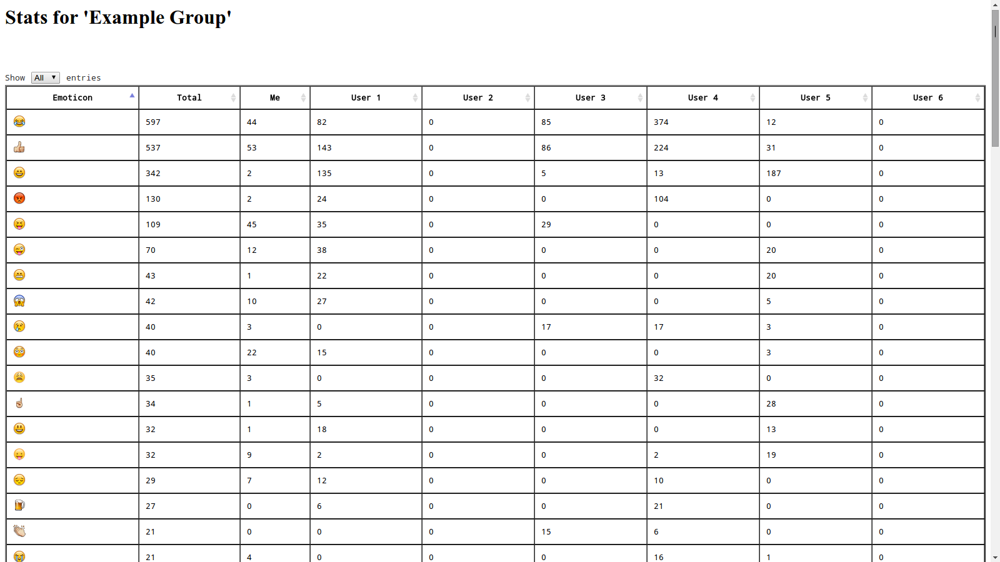
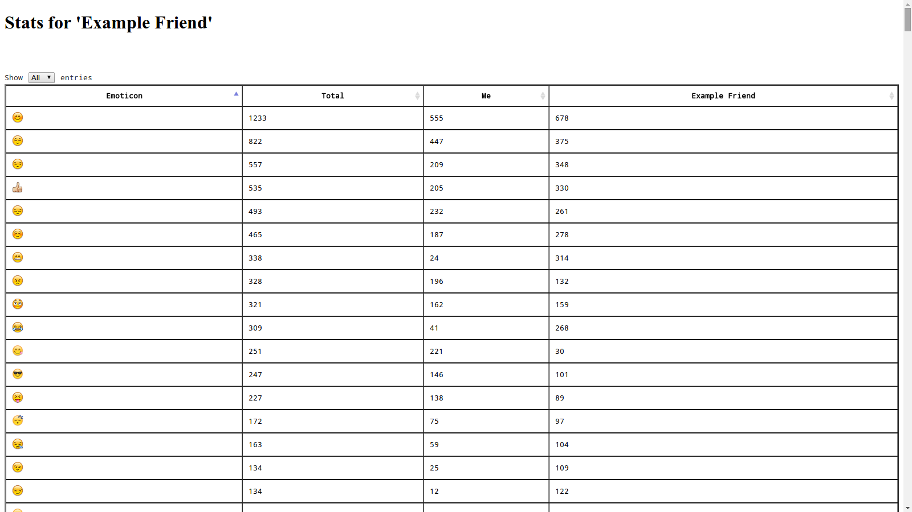

whatsapp-emoji-stats
====================

Get statistics on how you and your friends use whatsapp emojis (**Android ONLY**). The output is written as an html table (styled as a [datatable](http://www.datatables.net/) so you can sort based on different columns). The script currently understands 1054 emojis (which includes 208 country flags, not all of which are in whatsapp (yet)). This is what the output looks like (random data):

#### Group:


#### Single contact:


---

### Usage:

Before running the script you need to obtain the whatsapp's `msgstore.db` and `wa.db` files from your android device. These files are stored in the application data directory, which is not accessible (unless you have root access). [But you can still get these files without rooting your device (see below)](#getting-whatsapp-application-data-without-rooting-your-device):

```
./emoji_stats.py --msg-db <path_to_msgstore.db> --contacts-db <path_to_wa.db> --group-or-contact-regexp 'My Awesome Group' > awesome_group_emoji_stats.html
```

The output (HTML file) is printed on `stdout`, so redirect it accordingly. See `./emoji_stats.py --help` for detail about various command line options.

---
### Getting whatsapp application data without rooting your device:

I use the following procedure on Ubuntu, but you (probably) should be able to use it with some minor tweaks on your favorite OS.

##### Pre-requisites:
1. You will need to have `adb` installed (`sudo apt-get install android-tools-adb` for Ubuntu, *or* you can also get it as part of the [Android SDK](http://developer.android.com/sdk/index.html))
2. You will need to [turn on "Developer options" for your phone](http://developer.android.com/tools/device.html#device-developer-options).
3. You will need to have `openssl` (with libz support) installed (`sudo apt-get install libssl-dev` for Ubuntu).

##### Backup & extract the DB files:

1. Connect your phone to your computer using USB cable, and turn on USB debugging from "Settings -> Developer Options".
2. Use `adb` to backup the whatsapp data: `adb backup -noapk com.whatsapp`. Once you run the command you will be prompted to unlock your device (a popup on your phone). Allow it, and do *NOT* provide a password (we do *NOT* want to encrypt the data).
3. Now you will find a `backup.ab` file in your current directory, which is a compressed tar file (but we cannot use `tar` or `bunzip` to uncompress it directly, as the format is slightly different, so this is where `openssl` comes in). Do this to uncompress the file: `dd if=backup.ab bs=24 skip=1|openssl zlib -d > backup.tar`
4. Untar the file: `tar xvf backup.tar`
5. You will now find the required DB files (`msgstore.db`, `wa.db`) in: `./apps/com.whatsapp/db`.

---

Feel free to email @abiyani if you have any questions regarding the usage, and open issues if you notice any bug. Pull requests are always welcome. :)
